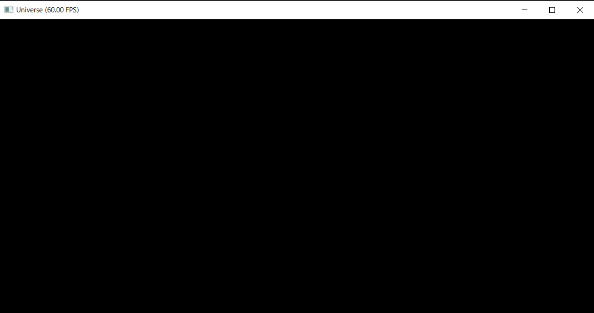

# Universus宇宙
《易经》有曰：“易有太极，太极生二仪，二仪生四象，四象生八卦。八卦成列，象在其中矣；因而重之，爻在其中矣；刚柔相推，变在其中矣；系辞焉而命之，动在其中矣。” 因此，本项目是太极(taichi)是宇宙的中心点，本项目是宇宙。

## 背景简介
宇宙。Nothing else,就是宇宙。

## 成功效果展示
没错，你看到的不仅仅是一张黑色的图片，它是宇宙。


## 整体结构（Optional）

```
-LICENSE
-|data
-README.MD
-xxx.py
```

## 运行方式
`python3 main.py`

## 调查问卷
以上这个project你认为：
 - A. 瞎搞
 - B. 嚯，有想法
 - C. 这个"宇宙"是缓兵之计，后面肯定会有一个正儿八经的作业。